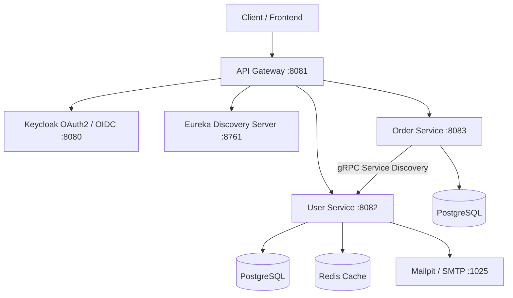

# 🚀 Spring Boot Microservices Starter

A production-ready microservices starter boilerplate built with **Spring Boot 3**, **Spring Cloud**, **gRPC**, **Keycloak**, **PostgreSQL**, **Redis**, and **Docker**.

> [!NOTE]
> **Starter Template**: This project uses a **Simple E-Commerce Domain** (User Service, Order Service, API Gateway) as a working reference implementation. You can easily customize, replace, or extend this starter by renaming domain models, modifying protobuf contracts in `grpc-common`, adding new microservices (e.g., `payment-service`, `inventory-service`), or replacing the business logic with your own domain needs!

---

## 🏗 Architecture Overview



---

## 📦 Services Overview

| Service | Port | Description | Tech Stack |
| :--- | :--- | :--- | :--- |
| **Eureka** | `8761` | Service Registration & Discovery | Spring Cloud Netflix Eureka |
| **API Gateway** | `8081` | Central Entry Point, Routing & Security | Spring Cloud Gateway MVC, OAuth2 Resource Server |
| **User Service** | `8082` / `9090` | User Management & Authentication | Keycloak Admin Client, Spring Data JPA, Redis, gRPC Server (`9090`) |
| **Order Service** | `8083` | Order Processing Example | Spring Data JPA, gRPC Client |
| **gRPC Common** | N/A | Shared Protobuf contracts & generated stubs | gRPC Java, Protobuf |

---

## 🔀 Mono-repo vs. Multi-repo Flexibility

This boilerplate is structured as a **Mono-repo** to simplify local development, testing, and one-command builds.

### 💡 Prefer Multi-repo?
If your team or organization prefers a **Multi-repository pattern** (where each service lives in its own Git repository):

1. **Extract Any Service**: You can move any subfolder (`eureka/`, `api-gateway/`, `user-service/`, `order-service/`) into its own separate Git repository.
2. **Publish `grpc-common`**: Publish the `grpc-common` artifact to a shared Maven repository (such as Nexus, GitHub Packages, or your local `.m2` repository) so individual services can consume the gRPC stubs as a standard dependency:
   ```bash
   cd grpc-common && mvn clean deploy
   ```
3. **Independent CI/CD**: Each repository can then maintain its own independent CI/CD pipeline and deployment schedule.

---

## 🚀 Quick Start Guide

### 1. Prerequisites
- **Java 17+**
- **Apache Maven 3.8+**
- **Docker & Docker Compose**

### 2. Start Infrastructure Services
Run PostgreSQL, Redis, Keycloak, and Mailpit using Docker Compose:

```bash
docker-compose up -d
```

* **Keycloak Admin Console**: `http://localhost:8080` (Username: `admin`, Password: `admin`)
* **Mailpit Web UI**: `http://localhost:8025` (For local email testing)

> [!TIP]
> **Automatic Keycloak Setup**: Keycloak is pre-configured to automatically import the `ecommerce` realm, `ecommerce-app` client, and default roles (`ROLE_USER`, `ROLE_ADMIN`) from [`keycloak/realm-export.json`](file:///D:/ecommerce/keycloak/realm-export.json) on container startup!

### 3. Build All Modules
Compile shared gRPC protobuf contracts and build all microservices with one Maven command:

```bash
mvn clean install
```

### 4. Run the Microservices
Start the services in your terminal (or IDE) in the following recommended order:

1. **Eureka Server**:
   ```bash
   cd eureka && mvn spring-boot:run
   ```
2. **User Service**:
   ```bash
   cd user-service && mvn spring-boot:run
   ```
3. **Order Service**:
   ```bash
   cd order-service && mvn spring-boot:run
   ```
4. **API Gateway**:
   ```bash
   cd api-gateway && mvn spring-boot:run
   ```

---

## 🔑 Keycloak Configuration & Realm Export

This project includes a pre-configured Keycloak export file located at [`keycloak/realm-export.json`](file:///D:/ecommerce/keycloak/realm-export.json).

* **Pre-configured Realm**: `ecommerce`
* **Pre-configured Client**: `ecommerce-app` (Client secret: `secret`)
* **Pre-configured Roles**: `ROLE_USER`, `ROLE_ADMIN`

### Exporting Your Own Keycloak Realm Settings
If you modify Keycloak roles, clients, or authentication flows in the admin console and want to save them to your repo:

1. Log into Keycloak (`http://localhost:8080`).
2. Go to **Realm Settings** $\rightarrow$ Click **Action** (top-right) $\rightarrow$ **Partial Export**.
3. Enable **Export groups and roles** and **Export clients**, then download the `.json` file.
4. Replace [`keycloak/realm-export.json`](file:///D:/ecommerce/keycloak/realm-export.json) in your repository.

---

## 🛠 Customizing & Extending the Starter

This template is designed to be easily modified for any domain:

* **Adding New Microservices**: Add a new module directory (e.g. `payment-service`) and include `<module>payment-service</module>` in the root [`pom.xml`](file:///D:/ecommerce/pom.xml).
* **Adding gRPC Endpoints**: Add new `.proto` definition files in [`grpc-common/src/main/proto/`](file:///D:/ecommerce/grpc-common/src/main/proto) and run `mvn clean install` to generate the Java stubs across all services.
* **Adding New Gateway Routes**: Add new route definitions under `spring.cloud.gateway.server.webmvc.routes` in [`api-gateway/src/main/resources/application.yaml`](file:///D:/ecommerce/api-gateway/src/main/resources/application.yaml).

---

## 📄 License
Licensed under the [MIT License](LICENSE).
